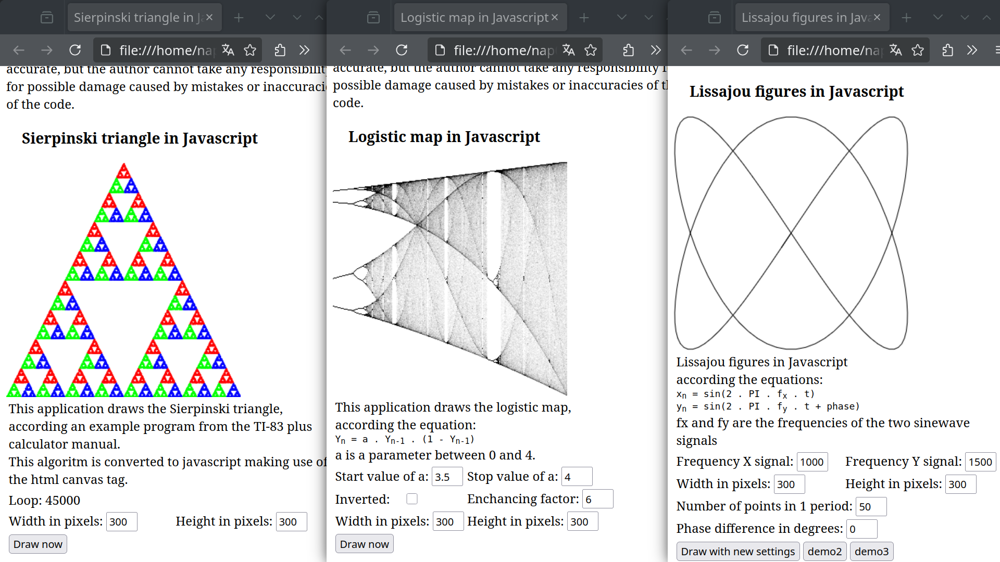

# Drawing on a canvas using Javascript

These three examples draw on a html canvas tag using Javascript. The Javascript code is embedded in the html file.
Tested on Firefox 136.0.1 before uploading.

## Screenshot of the three examples opened in Firefox

## Following files are included:

### sierpinski.html

Sierpinski triangle in javascript 
This application draws the Sierpinski triangle,
according an example program from the TI-83 plus calculator manual. This algoritm is converted to javascript making use of the html canvas tag. 

### logistic.html

Logistic map in javascript 
This application draws the logistic map,
according the equation:
Yn = a . Yn-1 . (1 - Yn-1)
a is a parameter between 0 and 4. 

### lissa.html

Lissajou figures in Javascript
according the equations:
xn = sin(2 . PI . fx . t)
yn = sin(2 . PI . fy . t + phase)
fx and fy are the frequencies of the two sinewave signals 

### index.html

Combines the three examples using html frames

### javascript_canvas_drawing_screenshot.png

Screenshot showing the three examples opened in Firefox

###  README.MD

This file
